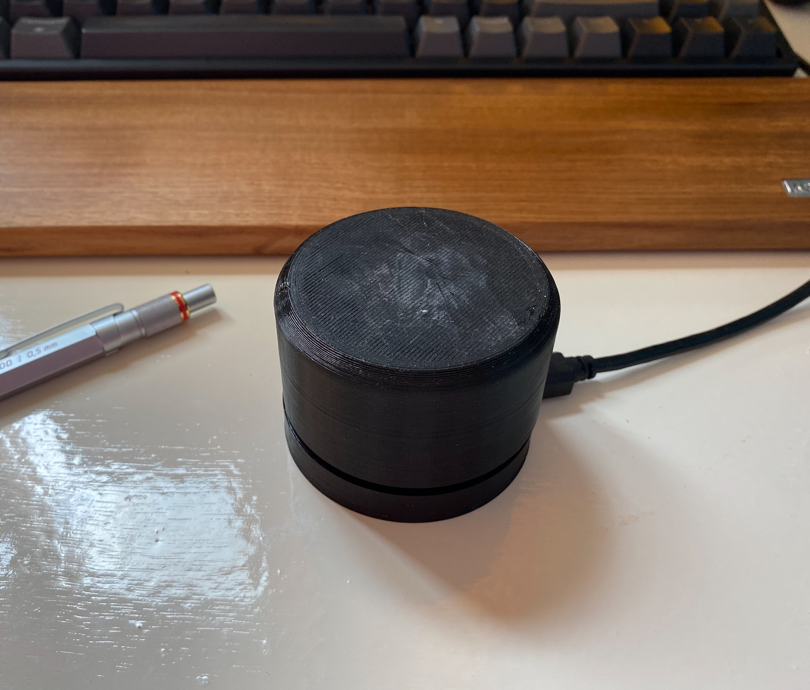

# Media Knob

Stand-alone media control knob, that works cross platform (its just a keyboard)

## Controls

- press: Play / Pause
- double press: Mute / Un-mute
- rotate: volume up and down
- hold (400ms) and rotate: previous / next

## Requirements

- Arduino Pro Micro
- Arduino IDE
- Rotary Encoder
- Dupont (female - female)
- 3D printer (or service)

## Set up

1. add TimerOne and HID-Project libs
2. add [ClickEncoder.h](https://github.com/soligen2010/encoder) lib
3. upload the media-knob script to the Pro Micro
4. wire up the board and rotary encoder
5. assemble

## Extra

- [ClickEncoder.h lib](https://github.com/soligen2010/encoder)
- [Other media commands](https://github.com/NicoHood/HID/blob/master/src/HID-APIs/ConsumerAPI.h)
